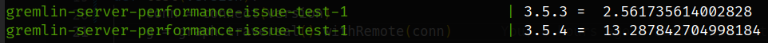

# A simple example that reproduces performance degradation in gremlin-server 3.5.4

## How to run
`docker compose up --build`

Wait till `gremlin-server-performance-issue-test-1` exists. It will print measured execution time.

